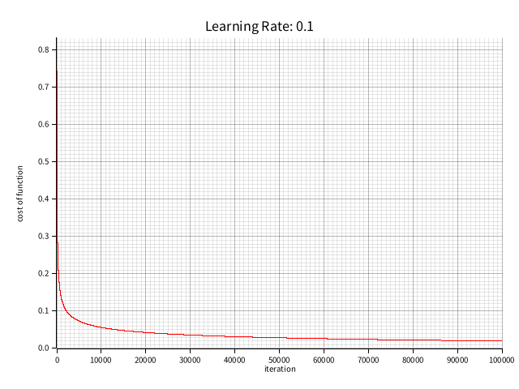

# ML learning - gradient descendent for logistic regression

[Course](https://www.coursera.org/learn/machine-learning/home/week/3)

---

Implement __gradient descendent for logistic regression__ using [Rust](https://www.rust-lang.org/learn).

Detailed implementation can be found in [the source code](./src/main.rs).

## Training

