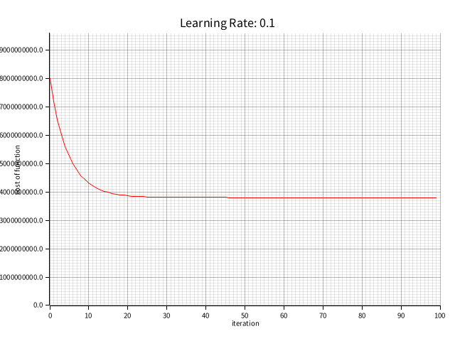

# ML learning - gradient descendent for univariate linear regression

[Course](https://www.coursera.org/learn/machine-learning/home/week/2)

---

Implement __gradient descendent for multiple linear regression__ using [Rust](https://www.rust-lang.org/learn).

Detailed implementation can be found in [the source code](./src/main.rs).

Using [seoul real estate transaction price - 2022](https://data.seoul.go.kr/dataList/OA-21275/S/1/datasetView.do) for training.

## Training

