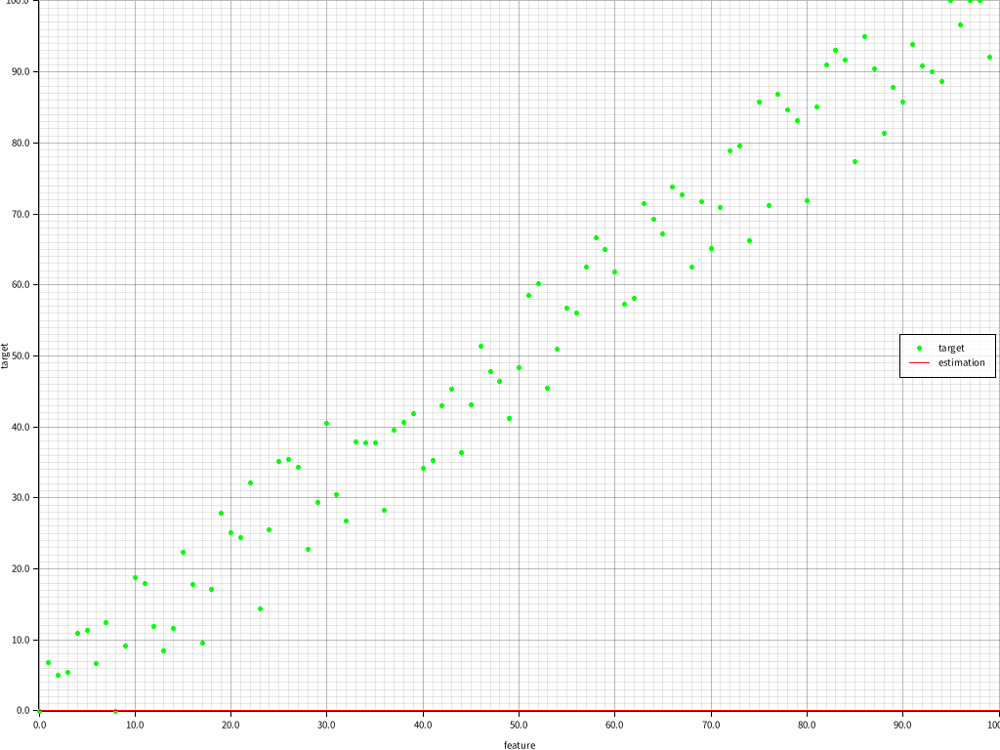
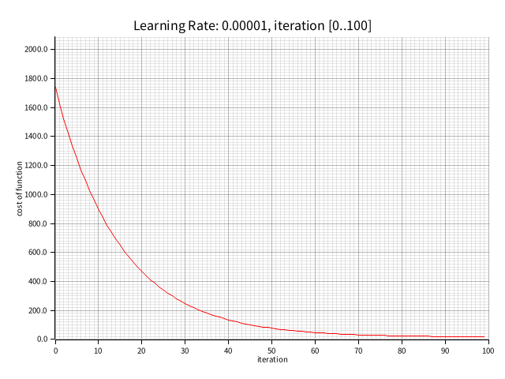
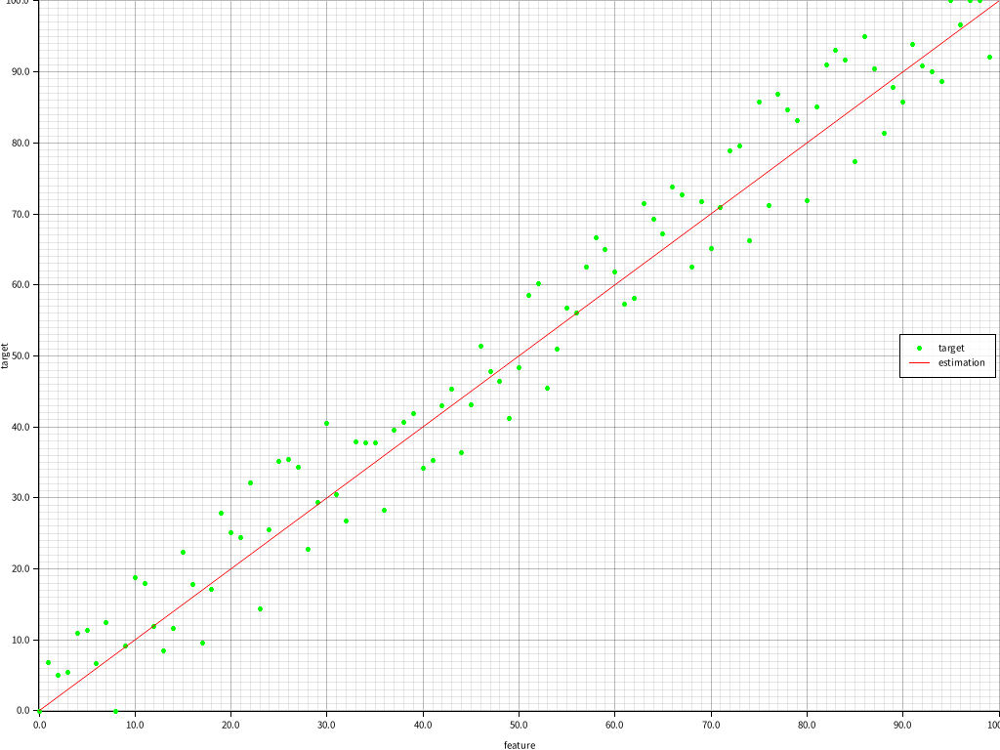

# ML learning - gradient descendent for univariate linear regression

[Course](https://www.coursera.org/learn/machine-learning/home/week/1)

---

Implement __gradient descendent for univariate linear regression__ using [Rust](https://www.rust-lang.org/learn).

Detailed implementation can be found in [the source code](./src/main.rs).

## Before training

## Training

## Aefore training
